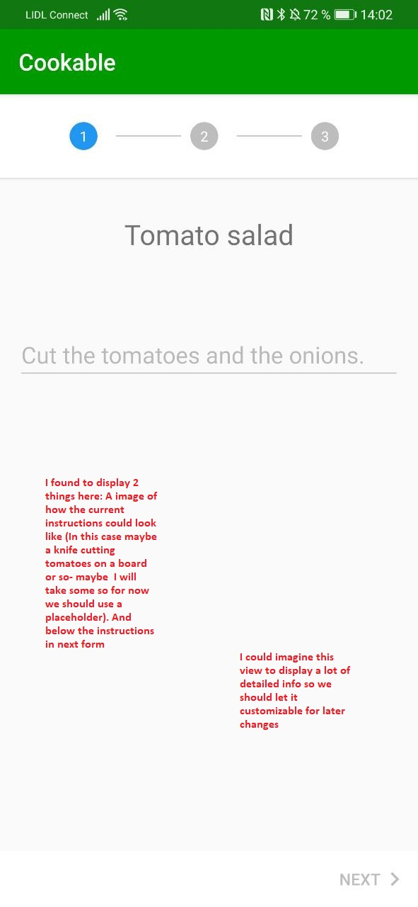

# cookable_flutter
# Owner : Awesome CEO Alex
[flutter-fire](https://firebase.flutter.dev/docs/auth/overview)
# UI Ideas
Most notes are written directly in the image
## The current login page
This page is currently displayed on app start when no user is logged in.
If a user is logged in it is displayed as long as it takes to load the data (recipes and so on) from the backend
We plan to spare users from registration but we still need a page which displays during app start for loading.
I'd suggest a screen showing the app logo and a progress bar and if the backend says there are promotions, a promotion card
which we could display here

## Use inventory screen/ fridge
This is the first screen displayed when loading has completed
Added some notes in the image. We should also consider using a better background (white is a bit boring). A customizable theme would be cool!
Later we could group this view into groups like meat, veggie, spices...

## Grocery Details screen
This screen is displayed when clicking on a grocery icon in the fridge/inventory screen

## Add Grovery screen
This screen is displayed when clicking on the "plus" in the fridge/inventory screen.
It is really ugly. The barcode icon can be left out completely.
What I have in mind for this is a filterable list which requests the api on each input.
Then if the user has found what he wants he should be able to click on it and specify the desired amount he currently has.
Would be cool to display this and the grocery details screen on top of the inventory.

## Current Behavior of "add grocery" screen

## Recipe view

Added some notes in the image. We should also consider using a better background (white is a bit boring). A customizable theme would be cool
The recipe view should apply a clear highlighting of cookable and now or weak highlighting of uncookable recipes.
Since this feature is the core of this app. We should think about a more stylish way than just applying a stronger color.
I could also imagine displaying recipes which only lack one single grocery differently. Also we should think about how to display
recipes with ingredients the user has in his inventory but in too low amounts.

## Recipe details screen

The next two images show the recipe details screen. We should use a cool light background here.

## Cook recipe stepper

This shows the instructions using a material stepper component. I can imagine a lot adjustments to what is displayed
in here. So we should keep it customizable

## (Yet) Uncovered Features
* :x: **About Page: ** This should be accessable easily over the menu. We need to include a reference for the icons we currently use for groceries (Usage agreement)
* :x: **MISSING INGREDIENT:** Very often a user won't find a grocery he has! We need to offer our users a way (e.g. once filtering for groceries delivers no results) to just apply  for a grocery to be added to the db. Nethertheless the preprovided db should cover most cases
* :x: **MISSING RECIPE/ADD RECIPE:** Registered users should be able to add their own recipes including intructions and images. We will probably need a sophisticated stepper component. Recipes who are uploaded by a user should also by editable by him.
* :x: **RATE RECIPE:** Very important feature that should be implemented. Registered users should be able to rate a recipe once.
* :heavy_check_mark: **NUTRITON:** A super important issue for everyone I want to target with this app. Values should be calculated by the backend using the sum of of the ingredient nutritions

## Technical issues
* :x: All images should be cached with an appropriate framework (We currently use cached_network_image, but not sure if caching works^^)
* :x: We need to be able to handle errors from the backend at all time and should use material snackbars to display it (we can beautify later)
* :x: Since we dont use registration we should define the point when registration is mandatory
  + As long as the user is unverified we need some identifier for him to apply a preregistration [check this!!](https://firebase.google.com/docs/auth/web/anonymous-auth)
  + From the point when it we want to register we can do Firebase auth to do a full registration
  + We might also need to include a data usage agreement
* :x: The number of recipes, instructions could potentially very large - We should not load everything at the beginning, especially images need huge bandwith
* :heavy_check_mark: We need a good library for proper scaling of images
* :x: We should add a settings page offering config options for
  + UI - Theme
  + Checkbox - No image load on wifi

## Getting Started

This project is a starting point for a Flutter application.

A few resources to get you started if this is your first Flutter project:

- [Lab: Write your first Flutter app](https://flutter.dev/docs/get-started/codelab)
- [Cookbook: Useful Flutter samples](https://flutter.dev/docs/cookbook)

For help getting started with Flutter, view our
[online documentation](https://flutter.dev/docs), which offers tutorials,
samples, guidance on mobile development, and a full API reference.
